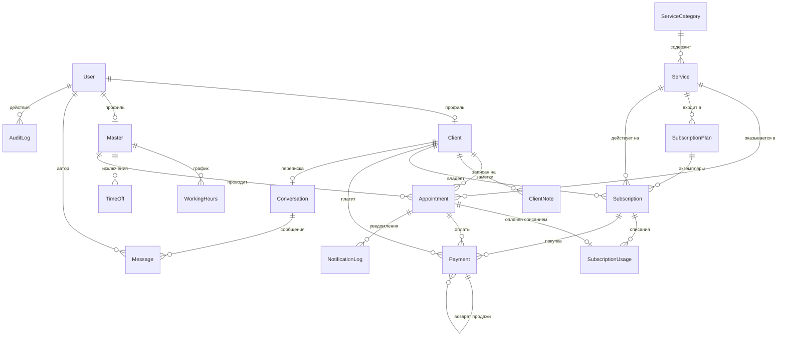
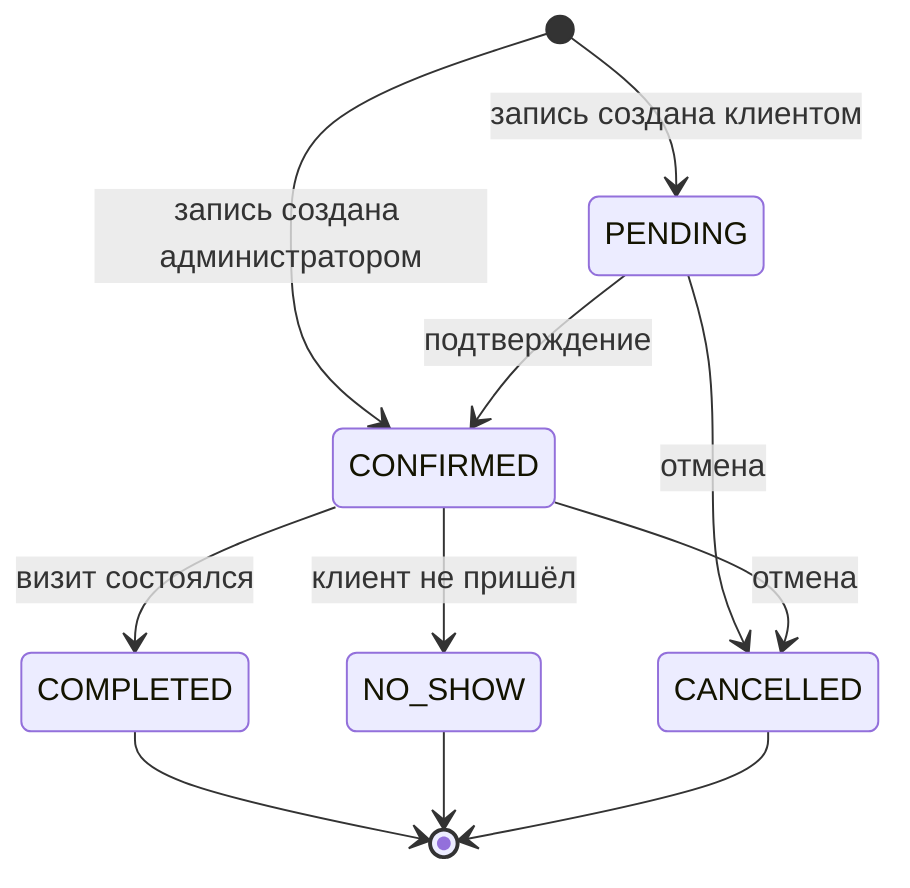

# Даталогическая модель

CRM частного массажного салона. СУБД — PostgreSQL 17, доступ через Prisma 7.x.

Инсталляция **single-tenant**: одна база = один салон. `Organization` — глобальная конфигурация инсталляции, а не tenant-сущность, поэтому `organizationId` в других таблицах отсутствует намеренно. Мультитенантность в требованиях не заявлена и добавляет сквозной ключ во все запросы без пользы.

## Соглашения

| Правило | Обоснование |
|---|---|
| Первичные ключи — `TEXT` (cuid) | Не раскрывают объём базы, безопасны в URL, не требуют координации при сидировании |
| Деньги — `INTEGER`, копейки | `FLOAT` даёт ошибки округления при подсчёте выручки; `DECIMAL` избыточен для одной валюты |
| Время — `TIMESTAMPTZ`, хранится в UTC | Таймзона салона живёт в `Organization.timezone`, конвертация только на границе UI |
| Длительность — `INTEGER`, минуты | Достаточная точность для расписания, удобно для арифметики слотов |
| Мягкое удаление — `isActive` / `archivedAt` | Услугу или клиента нельзя удалить физически: на них ссылается финансовая история |
| Изменяемые доменные сущности — `createdAt` + `updatedAt`; неизменяемые журнальные и технические записи — только `createdAt` | `Payment`, `Message`, `AuditLog` — append-only. `updatedAt` на них создавал бы ложное впечатление, что строку допустимо править: возврат оформляется новой строкой, а не изменением старой |
| Инварианты, выразимые в SQL, живут в БД; остальные — в доменном слое и покрыты тестами | Приложение может быть перезапущено, обойдено скриптом или воркером; констрейнт — нет |

---

## ER-диаграмма



`Organization` на диаграмме отсутствует сознательно — у неё нет связей, это строка конфигурации.

---

## 1. Организация и настройки

### `Organization`

Синглтон: одна строка на инсталляцию, уникальность гарантируется индексом по константе. Заполняется мастером настройки (`/setup`), до этого приложение редиректит все маршруты на wizard.

| Поле | Тип | Ограничения | Описание |
|---|---|---|---|
| `id` | TEXT | PK | |
| `name` | TEXT | NOT NULL | Название салона, выводится в письмах и шапке |
| `timezone` | TEXT | NOT NULL, default `Europe/Moscow` | IANA-таймзона; вся конвертация UTC↔локаль опирается на неё |
| `currency` | TEXT | NOT NULL, default `RUB` | Код валюты для форматирования |
| `slotStepMinutes` | INTEGER | NOT NULL, default 15 | Шаг сетки при поиске свободных слотов |
| `bufferMinutes` | INTEGER | NOT NULL, default 0 | Технический перерыв после сеанса (уборка, проветривание) |
| `minLeadTimeMinutes` | INTEGER | NOT NULL, default 120 | Минимальный запас до сеанса, за который клиент может записаться сам |
| `cancellationWindowHours` | INTEGER | NOT NULL, default 12 | За сколько часов клиент может отменить без последствий |
| `reminderOffsetMinutes` | INTEGER | NOT NULL, default 120 | Смещение напоминания (ТЗ: 2 часа) — вынесено в настройку, а не в код |
| `chargeSubscriptionOnNoShow` | BOOLEAN | NOT NULL, default true | Списывать ли сеанс абонемента при неявке — см. раздел 6 |
| `setupCompletedAt` | TIMESTAMPTZ | NULL | Флаг завершённости wizard; `NULL` → все маршруты ведут на `/setup` |

**Почему настройки, а не константы:** это ровно те параметры, которые салон реально хочет менять. Вынос их в БД избавляет от передеплоя и делает wizard осмысленным.

Обратите внимание: `bufferMinutes` здесь — **текущее** значение для новых записей. Уже созданные записи хранят собственный снимок буфера (раздел 6), поэтому изменение настройки не перестраивает существующее расписание.

---

## 2. Аутентификация и роли

### `User`

Учётная запись next-auth. Роли ровно две, как в ТЗ.

| Поле | Тип | Ограничения | Описание |
|---|---|---|---|
| `id` | TEXT | PK | |
| `email` | TEXT | NOT NULL, UNIQUE по `lower(btrim(email))` | Логин (magic link) |
| `emailVerified` | TIMESTAMPTZ | NULL | Требование next-auth |
| `name` | TEXT | NULL | |
| `role` | ENUM `Role` | NOT NULL, default `CLIENT` | `ADMIN` \| `CLIENT` |
| `isActive` | BOOLEAN | NOT NULL, default true | Блокировка доступа без удаления истории |

**Уникальность по нормализованному email.** Обычный `UNIQUE` в PostgreSQL считает `User@Example.com` и `user@example.com` разными строками — при magic-link-логине это означает две учётные записи на одного человека. Поэтому уникальный функциональный индекс по `lower(btrim(email))`, а запись всегда идёт уже нормализованной.

Таблицы `Account`, `Session`, `VerificationToken` — стандартный адаптер next-auth, в модели домена не участвуют, метки времени ведёт сам адаптер.

**Ключевое решение:** `User` отделён от `Client`. Клиент может существовать без учётной записи — администратор заводит карточку по телефону, и человек ни разу не заходит в систему. Позже карточка связывается с `User` по email. Слияние `User` и `Client` в одну таблицу сделало бы невозможным ведение офлайн-клиентов, а это большинство базы реального салона.

---

## 3. Мастера и расписание

### `Master`

Исполнитель услуг. Ресурс, занятость которого проверяется при записи.

| Поле | Тип | Ограничения | Описание |
|---|---|---|---|
| `id` | TEXT | PK | |
| `userId` | TEXT | FK → `User.id`, UNIQUE, NULL | Учётка мастера (роль `ADMIN`) |
| `displayName` | TEXT | NOT NULL | Имя для клиента |
| `specialization` | TEXT | NULL | |
| `color` | TEXT | NULL | Цвет в календаре |
| `isActive` | BOOLEAN | NOT NULL, default true | |

**Почему отдельная сущность при «частном мастере»:** ресурс расписания — это мастер, а не салон. Даже если сейчас он один, вынос ресурса в таблицу означает, что появление второго мастера — это строка в БД, а не рефакторинг движка слотов. Стоимость решения на старте нулевая.

### `WorkingHours`

Регулярный недельный график. Метки времени не ведутся: строка неизменяема, правка графика — это удаление и вставка.

| Поле | Тип | Ограничения | Описание |
|---|---|---|---|
| `id` | TEXT | PK | |
| `masterId` | TEXT | FK → `Master.id`, CASCADE | |
| `weekday` | SMALLINT | NOT NULL, CHECK 0..6 | 0 — воскресенье |
| `startMinute` | SMALLINT | NOT NULL, CHECK 0..1440 | Минуты от полуночи по локальному времени салона |
| `endMinute` | SMALLINT | NOT NULL, CHECK 0..1440, `> startMinute` | |

Хранение минутами, а не `TIME`, снимает проблему перехода на летнее время: график привязан к локальному дню («работаю с 10:00»), а не к абсолютному моменту.

**Смены одного дня не пересекаются:**

```sql
ALTER TABLE "WorkingHours"
  ADD CONSTRAINT workinghours_no_overlap
  EXCLUDE USING gist (
    "masterId" WITH =,
    "weekday"  WITH =,
    int4range("startMinute", "endMinute", '[)') WITH &&
  );
```

`UNIQUE (masterId, weekday, startMinute)` защищал бы только от совпадающего начала и пропустил бы пару 09:00–13:00 / 10:00–18:00 — генератор слотов вернул бы часть времени дважды. При этом две смены в день (09:00–13:00 и 15:00–19:00) остаются разрешены, а смежные интервалы 09:00–13:00 / 13:00–18:00 не считаются пересечением из-за полуоткрытого диапазона. Обычным `UNIQUE` такой инвариант не выражается.

### `TimeOff`

Исключения: отпуск, больничный, личное окно.

| Поле | Тип | Ограничения | Описание |
|---|---|---|---|
| `id` | TEXT | PK | |
| `masterId` | TEXT | FK → `Master.id`, CASCADE | |
| `startsAt` | TIMESTAMPTZ | NOT NULL | |
| `endsAt` | TIMESTAMPTZ | NOT NULL, `> startsAt` | |
| `reason` | TEXT | NULL | |

Индекс `(masterId, startsAt, endsAt)`.

**Свободные слоты не хранятся.** Они вычисляются как `WorkingHours − TimeOff − активные Appointment (с буфером)`, отфильтрованные по длительности услуги и шагу сетки. Материализация слотов в таблицу — типичная ошибка: она требует генерации на горизонт, ломается при изменении графика и создаёт второй источник правды.

---

## 4. Каталог услуг

### `ServiceCategory`

| Поле | Тип | Ограничения | Описание |
|---|---|---|---|
| `id` | TEXT | PK | |
| `name` | TEXT | UNIQUE, NOT NULL | «Классический», «Спортивный», «SPA» |
| `slug` | TEXT | UNIQUE, NOT NULL | |
| `sortOrder` | INTEGER | NOT NULL, default 0 | |

### `Service`

| Поле | Тип | Ограничения | Описание |
|---|---|---|---|
| `id` | TEXT | PK | |
| `categoryId` | TEXT | FK → `ServiceCategory.id`, RESTRICT | |
| `name` | TEXT | NOT NULL | |
| `slug` | TEXT | UNIQUE, NOT NULL | |
| `description` | TEXT | NULL | |
| `durationMinutes` | INTEGER | NOT NULL, CHECK > 0 | Чистая длительность сеанса |
| `priceMinor` | INTEGER | NOT NULL, CHECK ≥ 0 | Текущая цена в копейках |
| `isActive` | BOOLEAN | NOT NULL, default true | Снятие с продажи без потери истории |

Услуга **никогда не удаляется**: на неё ссылаются завершённые записи и финансовая отчётность. Изменение цены не переписывает прошлое — см. снимки в `Appointment`.

---

## 5. Клиенты

### `Client`

| Поле | Тип | Ограничения | Описание |
|---|---|---|---|
| `id` | TEXT | PK | |
| `userId` | TEXT | FK → `User.id`, UNIQUE, NULL | Связь с учёткой, если клиент зарегистрирован |
| `lastName` | TEXT | NOT NULL | |
| `firstName` | TEXT | NOT NULL | |
| `middleName` | TEXT | NULL | ФИО тремя полями — нужна сортировка и обращение по имени |
| `phone` | TEXT | UNIQUE, NOT NULL, CHECK формат E.164 | Основной идентификатор в салоне |
| `email` | TEXT | NULL, UNIQUE по `lower(btrim(email))` среди неархивированных | Нужен для email-напоминаний и связывания с `User` |
| `birthDate` | DATE | NULL | Поздравления и возрастные противопоказания |
| `source` | ENUM `ClientSource` | NULL | `WALK_IN` \| `REFERRAL` \| `SOCIAL` \| `SEARCH` \| `OTHER` |
| `noShowCount` | INTEGER | NOT NULL, default 0 | Денормализация: счётчик неявок |
| `archivedAt` | TIMESTAMPTZ | NULL | Мягкое удаление |

**Нормализация контактов.** Телефон хранится уже в E.164 (`+79991234567`) и проверяется регулярным выражением на уровне БД — иначе `+7 999 123-45-67` и `89991234567` создадут двух клиентов, и история посещений разъедется. Email клиента уникален среди неархивированных карточек: он используется для автоматического связывания карточки с `User` при первом входе, а связывание по неоднозначному ключу дало бы клиенту доступ к чужой истории.

`noShowCount` — сознательная денормализация ради сортировки и фильтров в списке клиентов. Пересчитывается из `Appointment` тем же сервисом, что меняет статус, и покрыт тестом на согласованность.

### `ClientNote`

Заметки типизированы, а не свалены в одно текстовое поле: противопоказание должно быть видно администратору при записи, а предпочтение — мастеру перед сеансом.

| Поле | Тип | Ограничения | Описание |
|---|---|---|---|
| `id` | TEXT | PK | |
| `clientId` | TEXT | FK → `Client.id`, CASCADE | |
| `authorUserId` | TEXT | FK → `User.id`, SET NULL | Кто написал |
| `type` | ENUM `NoteType` | NOT NULL | `CONTRAINDICATION` \| `PREFERENCE` \| `GENERAL` |
| `body` | TEXT | NOT NULL | |
| `isPinned` | BOOLEAN | NOT NULL, default false | Показывать в шапке карточки |

Записи с `type = CONTRAINDICATION` подсвечиваются в форме записи на сеанс — это то, ради чего заметки вообще существуют в массажном салоне.

---

## 6. Записи на сеанс

### `Appointment`

Центральная таблица системы.

| Поле | Тип | Ограничения | Описание |
|---|---|---|---|
| `id` | TEXT | PK | |
| `clientId` | TEXT | FK → `Client.id`, RESTRICT | |
| `masterId` | TEXT | FK → `Master.id`, RESTRICT | |
| `serviceId` | TEXT | FK → `Service.id`, RESTRICT | |
| `startsAt` | TIMESTAMPTZ | NOT NULL | |
| `endsAt` | TIMESTAMPTZ | NOT NULL, CHECK `= startsAt + durationMinutesSnapshot` | Конец сеанса для клиента |
| `blockedUntil` | TIMESTAMPTZ | NOT NULL, CHECK `= endsAt + bufferMinutesSnapshot` | Конец занятости мастера с учётом перерыва; участвует в EXCLUDE |
| `status` | ENUM `AppointmentStatus` | NOT NULL, default `PENDING` | См. диаграмму переходов |
| `serviceNameSnapshot` | TEXT | NOT NULL | Название на момент записи |
| `priceMinorSnapshot` | INTEGER | NOT NULL, CHECK ≥ 0 | Цена на момент записи |
| `durationMinutesSnapshot` | INTEGER | NOT NULL, CHECK > 0 | Длительность на момент записи |
| `bufferMinutesSnapshot` | INTEGER | NOT NULL, CHECK ≥ 0 | Перерыв на момент записи |
| `paymentMode` | ENUM `PaymentMode` | NOT NULL | `CASH_OR_CARD` \| `SUBSCRIPTION` |
| `clientComment` | TEXT | NULL | Пожелание клиента при записи |
| `internalNote` | TEXT | NULL | Видна только администратору |
| `cancelReason` | TEXT | NULL | |
| `cancelledAt` | TIMESTAMPTZ | NULL | |
| `cancelledByUserId` | TEXT | FK → `User.id`, SET NULL | Отменил клиент или салон — влияет на статистику |
| `completedAt` | TIMESTAMPTZ | NULL | |
| `noShowAt` | TIMESTAMPTZ | NULL | Момент фиксации неявки |
| `createdByUserId` | TEXT | FK → `User.id`, SET NULL | Кто создал запись |

**Индексы:**
- `(masterId, startsAt)` — выборка календаря на день/неделю
- `(clientId, startsAt DESC)` — история посещений в карточке
- `(status, startsAt)` — воркеры напоминаний и авто-переходы

#### Ограничение целостности расписания (ключевое)

```sql
CREATE EXTENSION IF NOT EXISTS btree_gist;

ALTER TABLE "Appointment" ADD CONSTRAINT appointment_no_overlap
  EXCLUDE USING gist (
    "masterId" WITH =,
    tstzrange("startsAt", "blockedUntil", '[)') WITH &&
  ) WHERE (status IN ('PENDING', 'CONFIRMED'));
```

Проверка занятости только в коде — гонка: два параллельных запроса читают «слот свободен» до того, как любой из них запишет. Констрейнт делает двойную бронь физически невозможной; приложение ловит нарушение (SQLSTATE `23P01`) и возвращает понятную ошибку «слот только что заняли». Отменённые и несостоявшиеся записи из констрейнта исключены — они не занимают время.

**Почему в диапазон входит `blockedUntil`, а не `endsAt`.** Если бы констрейнт закрывал только `[startsAt, endsAt)`, то при `bufferMinutes = 15` записи 10:00–11:00 и 11:00–12:00 не пересекались бы с точки зрения БД, и перерыв соблюдался бы только доброй волей приложения — то есть ровно до первого конкурентного запроса. Перерыв — часть занятости ресурса, поэтому он должен быть частью интервала, который защищает БД.

**Почему буфер — снимок, а не текущее значение `Organization.bufferMinutes`.** Изменение настройки не должно задним числом перекраивать интервалы уже созданных записей: смена буфера с 0 на 30 минут мгновенно сделала бы половину существующего расписания «пересекающейся» и уронила бы следующую же вставку. Снимок фиксирует правила, действовавшие в момент бронирования.

#### Согласованность интервала и снимков

```sql
ALTER TABLE "Appointment"
  ADD CONSTRAINT appointment_duration_consistent CHECK (
    "endsAt" = "startsAt" + "durationMinutesSnapshot" * INTERVAL '1 minute'
    AND "blockedUntil" = "endsAt" + "bufferMinutesSnapshot" * INTERVAL '1 minute'
  );
```

Инвариант «`endsAt` соответствует длительности» был заявлен в документации, но не проверялся: `endsAt > startsAt` пропустил бы сеанс на 15 минут при снимке длительности в 90. Теперь время визита и снимок не могут разойтись физически, а `endsAt > startsAt` становится следствием `durationMinutesSnapshot > 0` и отдельной проверки не требует.

#### Согласованность статуса и меток времени

```sql
ALTER TABLE "Appointment"
  ADD CONSTRAINT appointment_status_fields_consistent CHECK (
    (status = 'COMPLETED' AND "completedAt" IS NOT NULL AND "cancelledAt" IS NULL AND "noShowAt" IS NULL)
    OR (status = 'CANCELLED' AND "cancelledAt" IS NOT NULL AND "completedAt" IS NULL AND "noShowAt" IS NULL)
    OR (status = 'NO_SHOW'  AND "noShowAt"    IS NOT NULL AND "completedAt" IS NULL AND "cancelledAt" IS NULL)
    OR (status IN ('PENDING', 'CONFIRMED') AND "completedAt" IS NULL AND "cancelledAt" IS NULL AND "noShowAt" IS NULL)
  );
```

Без этого БД разрешила бы `status = COMPLETED` при `completedAt = NULL` — и финансовый отчёт, фильтрующий по дате завершения, молча потерял бы визит. Отдельное поле `noShowAt` добавлено, чтобы момент фиксации неявки не приходилось выковыривать из `updatedAt` или аудита.

**Снимки (`*Snapshot`) — не дублирование, а требование корректности.** Без них повышение цены задним числом изменило бы выручку за прошлый месяц. FK на `Service` сохраняется для аналитики «по услугам», снимок — для денег.

### Диаграмма переходов статусов



Побочные эффекты переходов (единственное место, где они разрешены — `lib/domain/appointment.ts`):

| Переход | Эффекты |
|---|---|
| `→ PENDING/CONFIRMED` | Проверка слота, резерв сеанса абонемента (`RESERVED`), постановка delayed-job напоминания |
| `→ COMPLETED` | `RESERVED → CONSUMED`, создание `Payment` (для разовой оплаты), `completedAt` |
| `→ NO_SHOW` | Инкремент `Client.noShowCount`, `noShowAt`; сеанс абонемента списывается или возвращается по настройке `chargeSubscriptionOnNoShow` |
| `→ CANCELLED` | `RESERVED → REVERTED`, снятие job напоминания, `cancelledAt` + автор |

**Про политику неявки.** Значение по умолчанию — `true`: сеанс списывается. Слот был выкуплен и потерян для салона, а бесплатная неявка снимает у клиента всякий стимул предупреждать. Это же основной практикуемый вариант в реальных салонах. Но политика вынесена в настройку, потому что для лояльной базы постоянных клиентов встречается и обратное решение, и оно не должно требовать правки кода. Значение показывается и объясняется в wizard.

---

## 7. Абонементы

### `SubscriptionPlan`

Шаблон пакета, который продаёт салон.

| Поле | Тип | Ограничения | Описание |
|---|---|---|---|
| `id` | TEXT | PK | |
| `serviceId` | TEXT | FK → `Service.id`, RESTRICT | Абонемент привязан к конкретной услуге |
| `name` | TEXT | NOT NULL | «Классический массаж, 10 сеансов» |
| `sessionsCount` | INTEGER | NOT NULL, CHECK > 0 | 5 или 10 по ТЗ, но не ограничено |
| `priceMinor` | INTEGER | NOT NULL, CHECK ≥ 0 | Цена пакета со скидкой |
| `validityDays` | INTEGER | NOT NULL, default 180, CHECK > 0 | Срок годности с момента покупки |
| `isActive` | BOOLEAN | NOT NULL, default true | |

Скидка не хранится отдельным полем — она производная: `1 − priceMinor / (sessionsCount × service.priceMinor)`. Хранение и цены, и процента скидки создало бы два источника правды, которые рано или поздно разойдутся.

### `Subscription`

Купленный экземпляр абонемента.

| Поле | Тип | Ограничения | Описание |
|---|---|---|---|
| `id` | TEXT | PK | |
| `clientId` | TEXT | FK → `Client.id`, RESTRICT | |
| `planId` | TEXT | FK → `SubscriptionPlan.id`, RESTRICT | |
| `serviceId` | TEXT | FK → `Service.id`, RESTRICT | На какую услугу действует |
| `serviceNameSnapshot` | TEXT | NOT NULL | Название услуги на момент покупки |
| `sessionsTotal` | INTEGER | NOT NULL, CHECK > 0 | Снимок из плана |
| `pricePaidMinor` | INTEGER | NOT NULL, CHECK ≥ 0 | Сколько фактически заплатили |
| `purchasedAt` | TIMESTAMPTZ | NOT NULL | |
| `expiresAt` | TIMESTAMPTZ | NOT NULL, `> purchasedAt` | `purchasedAt + validityDays` |
| `status` | ENUM `SubscriptionStatus` | NOT NULL, default `ACTIVE` | `ACTIVE` \| `EXHAUSTED` \| `EXPIRED` \| `REFUNDED` |

Индекс `(clientId, status)`, индекс `(status, expiresAt)` для воркера, помечающего сгоревшие.

**Про снимок услуги.** Изначально здесь была строка `serviceIdSnapshot` без внешнего ключа. Это худший из вариантов: Prisma не знает, что там услуга, relation-запрос невозможен, а значение может оказаться чем угодно — при том что услуги в системе физически не удаляются, то есть FK ничему не мешает. Заменено на настоящий FK `serviceId` плюс снимок названия. Аналитика «доход по услугам» получает нормальный join, а название на момент покупки остаётся в истории.

**Про статус — это денормализация, такая же как `noShowCount`.** Три из четырёх значений выводимы из данных (`usages`, `expiresAt`), и хранятся они ради индексируемых выборок «активные абонементы» на дашборде. Правило разделения:

- **Доступный остаток** — всегда вычисляемая величина, единственный источник правды при резервировании.
- **`status`** — lifecycle-метка, отражающая *фактическое* использование, а не резервы.

Отсюда семантика: `EXHAUSTED` ставится после последнего `CONSUMED`, а не после последнего `RESERVED`. Иначе абонемент с одним зарезервированным, но ещё не состоявшимся визитом отображался бы клиенту как использованный — а при отмене визита пришлось бы «воскрешать» его обратно в `ACTIVE`. Ситуация «сеансов больше не осталось, но не все ещё состоялись» решается не статусом, а запретом на новый резерв при нулевом доступном остатке.

Переходы и их триггеры (покрыты тестами):

| Переход | Когда |
|---|---|
| `ACTIVE → EXHAUSTED` | Последний сеанс перешёл в `CONSUMED` |
| `EXHAUSTED → ACTIVE` | Списание откатилось (`CONSUMED → REVERTED` при отмене завершённого визита) |
| `ACTIVE → EXPIRED` | Наступил `expiresAt`; воркер по расписанию |
| `* → REFUNDED` | Оформлен возврат; все `RESERVED` откатываются |

### `SubscriptionUsage`

Журнал списаний. **Остатка как поля нет.**

| Поле | Тип | Ограничения | Описание |
|---|---|---|---|
| `id` | TEXT | PK | |
| `subscriptionId` | TEXT | FK → `Subscription.id`, RESTRICT | |
| `appointmentId` | TEXT | FK → `Appointment.id`, **UNIQUE**, RESTRICT | Один визит — не более одного списания |
| `state` | ENUM `UsageState` | NOT NULL | `RESERVED` \| `CONSUMED` \| `REVERTED` |
| `reservedAt` | TIMESTAMPTZ | NOT NULL | Момент записи на сеанс |
| `consumedAt` | TIMESTAMPTZ | NULL | Момент завершения визита |
| `revertedAt` | TIMESTAMPTZ | NULL | Момент отмены |

`UNIQUE (appointmentId)` — защита от двойного списания при повторной отправке формы или ретрае задачи.

**Согласованность состояния и меток времени:**

```sql
ALTER TABLE "SubscriptionUsage"
  ADD CONSTRAINT subscription_usage_state_consistent CHECK (
    (state = 'RESERVED' AND "consumedAt" IS NULL AND "revertedAt" IS NULL)
    OR (state = 'CONSUMED' AND "consumedAt" IS NOT NULL AND "revertedAt" IS NULL)
    OR (state = 'REVERTED' AND "revertedAt" IS NOT NULL)
  );

ALTER TABLE "SubscriptionUsage"
  ADD CONSTRAINT subscription_usage_timeline_valid CHECK (
    ("consumedAt" IS NULL OR "consumedAt" >= "reservedAt")
    AND ("revertedAt" IS NULL OR "revertedAt" >= "reservedAt")
  );
```

Метки времени записи защищены аналогичным констрейнтом (раздел 6) — журнал списаний защищается по тому же принципу. У `REVERTED` поле `consumedAt` остаётся свободным: откатить можно как резерв (`consumedAt IS NULL`), так и уже потреблённое списание при отмене завершённого визита.

**Доступный остаток вычисляется:**

```sql
sessionsTotal − COUNT(*) FILTER (WHERE state IN ('RESERVED', 'CONSUMED'))
```

**Почему журнал, а не счётчик `remaining`:** счётчик — это агрегат без истории. При отмене визита его надо инкрементировать вручную, при ретрае задачи — не инкрементировать дважды, при споре с клиентом («у меня было 3 сеанса!») — нечего показать. Журнал делает откат простым переходом состояния, даёт полный аудит и не рассинхронизируется в принципе. Двухфазность (`RESERVED` → `CONSUMED`) нужна потому, что сеанс должен быть зарезервирован в момент записи — иначе клиент запишется десять раз по абонементу на пять сеансов.

**Инварианты (проверяются в транзакции доменного слоя и покрыты тестами):**
1. Число активных списаний не превышает `sessionsTotal`. Резерв выполняется в транзакции с `SELECT ... FOR UPDATE` по строке абонемента — иначе два параллельных бронирования спишут последний сеанс дважды.
2. Списать можно только с `Subscription.status = ACTIVE` и `expiresAt > now()`.
3. Услуга визита совпадает с `Subscription.serviceId`.
4. `Appointment.paymentMode = SUBSCRIPTION` ⟺ существует `SubscriptionUsage` в состоянии `RESERVED`/`CONSUMED`.

---

## 8. Финансы

### `Payment`

Денежное движение. Отдельная append-only таблица, а не сумма по записям.

| Поле | Тип | Ограничения | Описание |
|---|---|---|---|
| `id` | TEXT | PK | |
| `clientId` | TEXT | FK → `Client.id`, RESTRICT | |
| `appointmentId` | TEXT | FK → `Appointment.id`, **RESTRICT** | Оплата разового визита |
| `subscriptionId` | TEXT | FK → `Subscription.id`, **RESTRICT** | Покупка абонемента |
| `refundedPaymentId` | TEXT | FK → `Payment.id`, RESTRICT, NULL | Какую продажу отменяет этот возврат |
| `kind` | ENUM `PaymentKind` | NOT NULL | `SALE` \| `REFUND` |
| `amountMinor` | INTEGER | NOT NULL, CHECK > 0 | Всегда положительная; знак задаёт `kind` |
| `method` | ENUM `PaymentMethod` | NOT NULL | `CASH` \| `CARD` \| `TRANSFER` |
| `paidAt` | TIMESTAMPTZ | NOT NULL | |
| `comment` | TEXT | NULL | |

Индекс `(paidAt)` — основной для отчётов по периодам; `(clientId, paidAt)`; `(refundedPaymentId)`.

**Ровно один субъект платежа (XOR, а не OR):**

```sql
ALTER TABLE "Payment"
  ADD CONSTRAINT payment_has_exactly_one_subject CHECK (
    ("appointmentId" IS NOT NULL)::int + ("subscriptionId" IS NOT NULL)::int = 1
  );
```

Прежний `OR` разрешал строку, привязанную одновременно к визиту и к абонементу, — и такая строка попала бы в отчёт «доход по услугам» дважды либо была бы посчитана по неверной услуге. Продажа абонемента и оплата разового визита — разные события; если бизнесу когда-нибудь понадобится продать то и другое одним платежом, правильный ответ — сущность `Order` с позициями, а не одна платёжная строка с двумя ссылками.

**Почему `RESTRICT`, а не `SET NULL` на субъектах платежа.** С `SET NULL` удаление визита обнулило бы `appointmentId`, и XOR-констрейнт немедленно нарушился бы: обе ссылки пусты. Формально `SET NULL`, фактически — запрет на удаление, но падающий с невнятной ошибкой про CHECK вместо внятной про внешний ключ. `RESTRICT` выражает то, что и так верно по домену: сущность, к которой привязано денежное движение, физически не удаляется.

**Возврат связан с продажей:**

```sql
ALTER TABLE "Payment"
  ADD CONSTRAINT payment_refund_link CHECK (
    (kind = 'SALE'   AND "refundedPaymentId" IS NULL)
    OR (kind = 'REFUND' AND "refundedPaymentId" IS NOT NULL)
  );

ALTER TABLE "Payment"
  ADD CONSTRAINT payment_cannot_refund_itself CHECK (
    "refundedPaymentId" IS NULL OR "refundedPaymentId" <> id
  );
```

Без ссылки возврат — это просто отрицательное число в отчёте, по которому нельзя ни сверить кассу, ни ответить на вопрос «что именно вернули». Второй констрейнт нужен потому, что `id` — cuid, сгенерированный приложением до вставки: строка технически может сослаться сама на себя, и внешний ключ этому не помешает.

Остальные правила возврата требуют чтения другой строки и живут в доменном слое (инварианты 14 и 18): исходный платёж имеет `kind = SALE`, относится к тому же клиенту и тому же субъекту, а сумма всех возвратов не превышает сумму продажи.

**Почему не считать выручку суммой по `Appointment`:** оплата абонемента происходит один раз, а визитов по нему десять — при подсчёте по записям выручка удвоится либо потеряется. Плюс возвраты и предоплаты некуда положить. Отдельный журнал платежей делает финансовые отчёты линейным сканом одной таблицы с индексом по дате.

**Как считаются метрики ТЗ:**

| Метрика | Источник |
|---|---|
| Доход по дням/неделям/месяцам | `SUM(±amountMinor)` по `Payment.paidAt`, группировка по `date_trunc` |
| Доход по услугам | `Payment → Appointment.serviceId` для визитов, `Payment → Subscription.serviceId` для абонементов |
| Средний чек | Чистая выручка / число платежей `kind = SALE` за период |
| Средняя выручка на визит | Чистая выручка / число `COMPLETED` визитов за период |
| Возвратность | Доля клиентов с ≥2 `COMPLETED` визитами; retention-60 — вернувшиеся в течение 60 дней после первого визита |

**Средний чек и выручка на визит — разные метрики, и их нельзя смешивать.** Клиент купил абонемент за 40 000 ₽ и сходил дважды: средний чек равен 40 000 ₽ (была одна продажа), а выручка на визит — 20 000 ₽. Формула «выручка / визиты», названная средним чеком, при абонементах даёт заведомо неверное число и занижает его тем сильнее, чем лучше продаются пакеты. На дашборде показываются обе, с подписями. Если появится `Order`, средний чек начнёт считаться по заказам, а не по строкам платежей.

---

## 9. Уведомления

### `NotificationLog`

| Поле | Тип | Ограничения | Описание |
|---|---|---|---|
| `id` | TEXT | PK | |
| `appointmentId` | TEXT | FK → `Appointment.id`, CASCADE, NULL | Субъект — визит |
| `subscriptionId` | TEXT | FK → `Subscription.id`, CASCADE, NULL | Субъект — абонемент |
| `type` | ENUM `NotificationType` | NOT NULL | `REMINDER_2H` \| `BOOKING_CONFIRMED` \| `CANCELLED` \| `SUBSCRIPTION_EXPIRING` |
| `channel` | ENUM `NotificationChannel` | NOT NULL | `EMAIL` (расширяемо до SMS/Telegram) |
| `status` | ENUM `NotificationStatus` | NOT NULL | `SCHEDULED` \| `SENT` \| `FAILED` \| `CANCELLED` |
| `scheduledFor` | TIMESTAMPTZ | NOT NULL | |
| `sentAt` | TIMESTAMPTZ | NULL | |
| `attempts` | INTEGER | NOT NULL, default 0 | Число выполненных попыток |
| `lastError` | TEXT | NULL | Ошибка последней попытки |
| `jobId` | TEXT | NULL | ID задачи BullMQ для отмены при переносе |

**Субъект уведомления зависит от типа.** Уведомление о сгорающем абонементе относится к `Subscription`, а не к визиту, — при обязательном `appointmentId` этот тип было бы невозможно использовать, не выдумывая фиктивную запись. Тип оставлен, потому что «сгорело четыре сеанса, меня не предупредили» — типичный конфликт салона с клиентом, и предупреждение здесь имеет прямую денежную ценность. Субъект сделан явным:

```sql
ALTER TABLE "NotificationLog"
  ADD CONSTRAINT notification_subject_valid CHECK (
    (type IN ('REMINDER_2H', 'BOOKING_CONFIRMED', 'CANCELLED')
      AND "appointmentId" IS NOT NULL AND "subscriptionId" IS NULL)
    OR (type = 'SUBSCRIPTION_EXPIRING'
      AND "subscriptionId" IS NOT NULL AND "appointmentId" IS NULL)
  );
```

**Идемпотентность — два частичных индекса, а не составной `UNIQUE`.** Обычный `UNIQUE (appointmentId, type)` по обнуляемой колонке бесполезен для второй ветки: в PostgreSQL `NULL` не равен `NULL`, поэтому строки с пустым `appointmentId` не конфликтуют между собой, и защита от повторного письма про абонемент исчезла бы молча.

```sql
CREATE UNIQUE INDEX notification_unique_per_appointment
  ON "NotificationLog" ("appointmentId", type) WHERE "appointmentId" IS NOT NULL;

CREATE UNIQUE INDEX notification_unique_per_subscription
  ON "NotificationLog" ("subscriptionId", type) WHERE "subscriptionId" IS NOT NULL;
```

Перезапуск воркера или ретрай задачи не приведут к повторному письму клиенту.

Отдельной таблицы попыток (`NotificationAttempt`) нет сознательно: BullMQ хранит историю ретраев и стек-трейсы в Redis, а в БД достаточно счётчика и последней ошибки для ответа на вопрос «почему клиент не получил письмо». Полный журнал попыток дублировал бы очередь и рос быстрее, чем приносил пользу.

---

## 10. Чат

### `Conversation`

| Поле | Тип | Ограничения | Описание |
|---|---|---|---|
| `id` | TEXT | PK | |
| `clientId` | TEXT | FK → `Client.id`, UNIQUE, CASCADE | Один тред на клиента |
| `lastMessageAt` | TIMESTAMPTZ | NULL | Денормализация для сортировки списка диалогов |

### `Message`

Текст и автор сообщения неизменяемы; единственное допустимое изменение строки — установка `readAt`. Поэтому `updatedAt` не ведётся: его значением было бы то же самое `readAt`. Выносить прочтения в отдельную сущность имеет смысл в групповых чатах, где у сообщения много читателей; здесь сторон всегда две.

| Поле | Тип | Ограничения | Описание |
|---|---|---|---|
| `id` | TEXT | PK | |
| `conversationId` | TEXT | FK → `Conversation.id`, CASCADE | |
| `senderUserId` | TEXT | FK → `User.id`, SET NULL | |
| `senderRole` | ENUM `Role` | NOT NULL | Снимок роли: сообщение остаётся «от салона», даже если учётка удалена |
| `body` | TEXT | NOT NULL, CHECK длина после trim > 0 | |
| `readAt` | TIMESTAMPTZ | NULL | Непрочитанные — по `readAt IS NULL` |

Индекс `(conversationId, createdAt DESC)`.

Транспорт — SSE поверх этих таблиц. WebSocket-инфраструктура ради текстового чата двух сторон не оправдана: SSE переживает reconnect, работает через обратный прокси без отдельной настройки и не требует второго процесса.

---

## 11. Аудит

### `AuditLog`

Append-only.

| Поле | Тип | Ограничения | Описание |
|---|---|---|---|
| `id` | TEXT | PK | |
| `actorUserId` | TEXT | FK → `User.id`, SET NULL | `NULL` — действие системы (воркер) |
| `entity` | TEXT | NOT NULL | `Appointment`, `Subscription`, `Payment` |
| `entityId` | TEXT | NOT NULL | |
| `action` | TEXT | NOT NULL | `create`, `status_change`, `refund` |
| `diff` | JSONB | NULL | Изменённые поля до/после |

Индекс `(entity, entityId, createdAt DESC)`.

Пишется только для сущностей, вокруг которых возникают споры: записи, абонементы, деньги. Тотальный аудит всех таблиц — лишний объём без пользы.

---

## Сводка связей

| Связь | Тип | Правило удаления | Комментарий |
|---|---|---|---|
| `User → Client` | 1:0..1 | SET NULL | Клиент живёт без учётки |
| `User → Master` | 1:0..1 | SET NULL | |
| `Master → WorkingHours` | 1:N | CASCADE | График не имеет смысла без мастера |
| `Master → TimeOff` | 1:N | CASCADE | |
| `Master → Appointment` | 1:N | RESTRICT | Мастера с историей нельзя удалить |
| `ServiceCategory → Service` | 1:N | RESTRICT | |
| `Service → Appointment` | 1:N | RESTRICT | |
| `Service → SubscriptionPlan` | 1:N | RESTRICT | |
| `Service → Subscription` | 1:N | RESTRICT | Прямой FK вместо строкового снимка |
| `Client → Appointment` | 1:N | RESTRICT | Только архивирование |
| `Client → ClientNote` | 1:N | CASCADE | |
| `Client → Subscription` | 1:N | RESTRICT | |
| `Client → Payment` | 1:N | RESTRICT | |
| `Client → Conversation` | 1:0..1 | CASCADE | |
| `SubscriptionPlan → Subscription` | 1:N | RESTRICT | |
| `Subscription → SubscriptionUsage` | 1:N | RESTRICT | |
| `Appointment → SubscriptionUsage` | 1:0..1 | RESTRICT | UNIQUE на `appointmentId` |
| `Appointment → Payment` | 1:N | RESTRICT | Иначе обнуление ссылки нарушит XOR |
| `Subscription → Payment` | 1:N | RESTRICT | То же |
| `Payment → Payment` | 1:N | RESTRICT | Возврат ссылается на продажу |
| `Appointment → NotificationLog` | 1:N | CASCADE | Субъект уведомления по типу |
| `Subscription → NotificationLog` | 1:N | CASCADE | То же |
| `Conversation → Message` | 1:N | CASCADE | |

---

## Перечисления

| Enum | Значения |
|---|---|
| `Role` | `ADMIN`, `CLIENT` |
| `ClientSource` | `WALK_IN`, `REFERRAL`, `SOCIAL`, `SEARCH`, `OTHER` |
| `NoteType` | `CONTRAINDICATION`, `PREFERENCE`, `GENERAL` |
| `AppointmentStatus` | `PENDING`, `CONFIRMED`, `COMPLETED`, `NO_SHOW`, `CANCELLED` |
| `PaymentMode` | `CASH_OR_CARD`, `SUBSCRIPTION` |
| `SubscriptionStatus` | `ACTIVE`, `EXHAUSTED`, `EXPIRED`, `REFUNDED` |
| `UsageState` | `RESERVED`, `CONSUMED`, `REVERTED` |
| `PaymentKind` | `SALE`, `REFUND` |
| `PaymentMethod` | `CASH`, `CARD`, `TRANSFER` |
| `NotificationType` | `REMINDER_2H`, `BOOKING_CONFIRMED`, `CANCELLED`, `SUBSCRIPTION_EXPIRING` |
| `NotificationChannel` | `EMAIL` |
| `NotificationStatus` | `SCHEDULED`, `SENT`, `FAILED`, `CANCELLED` |

---

## Инварианты модели

### Гарантируются PostgreSQL

| # | Инвариант | Механизм |
|---|---|---|
| 1 | Две активные записи одного мастера не пересекаются с учётом перерыва | `EXCLUDE USING gist` по `[startsAt, blockedUntil)` |
| 2 | Смены одного мастера в один день не пересекаются | `EXCLUDE USING gist` по `int4range(startMinute, endMinute)` |
| 3 | `endsAt = startsAt + durationMinutesSnapshot`, `blockedUntil = endsAt + bufferMinutesSnapshot` | CHECK |
| 4 | Метки времени соответствуют статусу записи | CHECK |
| 5 | Состояние и метки времени списания согласованы, метки не раньше резерва | CHECK |
| 6 | Один визит — не более одного списания абонемента | `UNIQUE (appointmentId)` |
| 7 | Платёж привязан ровно к одному субъекту | CHECK (XOR) |
| 8 | Возврат ссылается на продажу, продажа — ни на что, и никто — сам на себя | CHECK |
| 9 | Субъект уведомления соответствует его типу | CHECK |
| 10 | Уведомление уникально по паре (субъект, тип) | Два частичных `UNIQUE`-индекса |
| 11 | Email и телефон уникальны в нормализованном виде | Функциональные `UNIQUE`-индексы + CHECK формата |
| 12 | Деньги и длительности неотрицательны | CHECK |
| 13 | `Organization` — **не более** одной строки | `UNIQUE INDEX ON ((true))` |

Про пункт 13: индекс гарантирует «0 или 1», но не наличие строки. После миграций база пуста ровно до тех пор, пока не завершён wizard, — существование конфигурации обеспечивает setup-процесс, а не БД, и приложение обязано корректно работать в состоянии «организации ещё нет» (редирект на `/setup`).

### Гарантируются доменным слоем (требуют агрегатов или бизнес-контекста)

| # | Инвариант | Реализация |
|---|---|---|
| 14 | Запись укладывается в `WorkingHours` и не попадает в `TimeOff` | Проверка при создании; тест |
| 15 | Активных списаний ≤ `sessionsTotal` | Транзакция + `SELECT FOR UPDATE` по абонементу |
| 16 | Списание — только с активного, неистёкшего абонемента на ту же услугу | Транзакция; тест |
| 17 | Сумма возвратов ≤ суммы исходной продажи | Транзакция + блокировка исходного платежа |
| 18 | Возврат относится к продаже того же клиента и того же субъекта | Проверка в транзакции возврата; тест |
| 19 | Переход статуса записи допустим только по диаграмме | Машина состояний в `lib/domain/appointment.ts`; недопустимый переход — ошибка домена |
| 20 | Переход состояния списания допустим только по схеме `RESERVED → CONSUMED → REVERTED` | Машина состояний в `lib/domain/subscription.ts` |
| 21 | `Client.noShowCount` согласован с `Appointment` | Пересчёт в том же сервисе; тест на согласованность |
| 22 | `Subscription.status` согласован с журналом и `expiresAt` | Пересчёт при переходах + воркер `EXPIRED`; тесты на все переходы |

---

## Миграции и ручной SQL

Часть ограничений (EXCLUDE, CHECK, функциональные индексы) Prisma не декларирует. Чтобы не возникло двух источников правды, процесс детерминирован:

1. Ограничения пишутся в `prisma/sql/<NNNN>_<name>.sql` — читаемые, с комментариями, ревьюятся отдельно от сгенерированного DDL.
2. Миграция создаётся скриптом `npm run db:migration -- <name> <sql-file>`: он выполняет `prisma migrate dev --create-only` и дописывает соответствующий SQL-файл в конец `migration.sql`. Ручного копирования нет.
3. `migration.sql` остаётся единственным исполняемым артефактом.
4. Ограничения проверяются двумя слоями тестов (ниже).

### Два слоя проверки ограничений

Проверять наличие имени в `pg_constraint` недостаточно: если подменить в `appointment_no_overlap` поле `blockedUntil` на `endsAt`, имя останется прежним, тест на наличие пройдёт, а защита буфера исчезнет. Ровно этот сценарий — правка схемы агентом — и был причиной завести тест.

**`tests/db/constraints.structure.spec.ts`** сравнивает не имена, а нормализованные определения: `pg_get_constraintdef()` для констрейнтов и `indexdef` из `pg_indexes` для индексов, снимками. PostgreSQL приводит выражение к канонической форме, поэтому снимок реагирует на смысловое изменение и не ломается от форматирования.

**`tests/db/constraints.behavior.spec.ts`** выполняет конфликтующие операции против реальной базы:

| Сценарий | Ожидание |
|---|---|
| Две пересекающиеся записи одного мастера | `23P01` |
| Запись, начинающаяся внутри `blockedUntil` предыдущей | `23P01` |
| Запись ровно в момент `blockedUntil` | успех |
| Та же пара интервалов, но у разных мастеров | успех |
| Пересекающиеся смены `WorkingHours` в один день | `23P01` |
| Смежные смены 09:00–13:00 / 13:00–18:00 | успех |
| `endsAt`, не соответствующий снимку длительности | `23514` |
| `COMPLETED` без `completedAt` | `23514` |
| Платёж с двумя субъектами и платёж без субъектов | `23514` |
| Возврат, ссылающийся сам на себя | `23514` |
| Два параллельных резерва последнего сеанса абонемента | ровно один успешен |
| Повторная постановка того же уведомления | `23505` |

Поведенческие тесты для агентской доработки ценнее структурных: они фиксируют намерение, а не форму реализации. Структурные оставлены как быстрый детектор молчаливого дрейфа — они падают сразу и с понятным диффом, тогда как поведенческий тест указывает на симптом.

Всё вместе существенно для требования «архитектура должна поддерживать агентскую доработку»: агент не обязан помнить инструкцию из README, за него отвечает падающий тест.

**Версия Prisma зафиксирована на 7.9.1** — все три пакета (`prisma`, `@prisma/client`, `@prisma/adapter-pg`) без диапазона `^`, чтобы они не разъехались между мажорами. В 7.x строка подключения живёт в `prisma.config.ts`, а не в `datasource`, и клиент работает через driver adapter вместо Rust-движка: из рантайм-образа уходит бинарник, что заметно для развёртывания на VPS. Тип модели в сгенерированном клиенте называется `XModel` (`OrganizationModel`), а не `X` — частая точка спотыкания при переходе с 6.x.

---

## Объём сид-данных

По ТЗ: 10 клиентов, 6 услуг (3 категории), 30 записей, 5 абонементов. Дополнительно для осмысленности дашборда и отчётов: 1–2 мастера с графиком, платежи по всем завершённым визитам, часть записей в прошлом (`COMPLETED`, `NO_SHOW`), часть — на ближайшие дни (`CONFIRMED`), несколько списаний по абонементам, один возврат, пара диалогов в чате.
